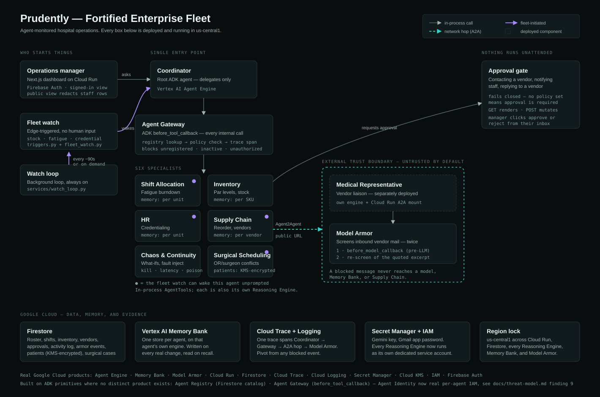

# Architecture

`architecture.svg` is the source of truth; `architecture.png` is a 2× raster of the same file
for the Devpost submission form. Both are also served by the dashboard at
`/architecture.svg`.

## The shape of it in one paragraph

A hospital operations manager talks to exactly one agent. The **Coordinator** — a root ADK
agent on Vertex AI Agent Engine — never answers from its own knowledge; it delegates. Every
internal delegation passes through the **Agent Gateway**, an ADK `before_tool_callback` that
looks the target up in a Firestore agent registry, checks a policy table, opens a Cloud Trace
span, and only then lets the call through. Five specialists sit behind it. One of them, Supply
Chain, reaches a sixth agent — the **Medical Representative** — across a real trust boundary
over Agent2Agent, at the same public agent-card URL any outside client would use. That agent
exists to handle untrusted vendor mail, and **Model Armor** screens everything it receives
before a model sees any of it. Nothing with a real-world consequence happens without the
manager clicking approve in their inbox.

## What runs where

| Component | Deployment | Notes |
|---|---|---|
| Coordinator | Vertex AI Agent Engine | Root agent, sole user-facing entry point |
| Shift, Inventory, Supply Chain, HR, Chaos | In-process `AgentTool`s **and** one Reasoning Engine each | Coordinator stages each folder via `--extra_packages` |
| Medical Representative | Own Reasoning Engine **and** a Cloud Run A2A mount | `/a2a/medrep` on `prudently-api` |
| `prudently-api` | Cloud Run | FastAPI: dashboard routes, approvals, the A2A mount, the fleet watch |
| `prudently-web` | Cloud Run | Next.js dashboard |

## Three things the diagram is making a point about

**The Gateway is on the hot path, not beside it.** Every specialist call is intercepted before
the tool body runs. An agent that is not in the registry, or is registered but inactive, or is
not on the caller's allow-list, is refused and the refusal is logged with a trace ID. This is
how the fleet is "cataloged for cross-department use" in a way that has teeth: the catalog is
consulted on every call rather than published and ignored.

**The trust boundary is a network hop, not a diagram convention.** Supply Chain does not have a
privileged path to the Medical Representative. It builds a `RemoteA2aAgent` against the public
agent-card URL and goes out over the internet to a separately deployed agent. Model Armor then
screens inbound content twice: once in a `before_model_callback`, which returns an
`LlmResponse` and so skips the Gemini call entirely, and again on the quoted excerpt the model
itself extracts. The second layer is not belt-and-braces theatre — it is what actually caught a
paraphrase-wrapped injection that the first layer passed.

**Autonomy stops at the approval gate.** The fleet watch decides *when to raise something*; it
never acquired permission to act unsupervised. A trigger wakes an agent, the agent decides, and
the moment that decision touches the outside world it becomes a pending approval in the
manager's inbox. `check_policy()` fails closed, so a task type nobody has configured requires
approval rather than silently auto-sending.

## Where the data lives

- **Firestore** — roster, shift history, inventory, vendors, purchase orders, payroll, plus the
  audit surfaces: `activity_log`, `approvals`, `armor_events`, `chaos_experiments`,
  `autonomous_actions`, and `fleet_watch/state`.
- **Vertex AI Memory Bank** — one store per agent, on that agent's own Reasoning Engine, scoped
  by `(app_name, user_id)`: Shift by unit, Inventory by SKU. Written whenever the real-time
  fleet watch observes a real change and read back by each agent's own recall tool.
- **Cloud Trace + Cloud Logging** — one trace spans Coordinator → Gateway → Supply Chain → the
  A2A hop → Cloud Run's ASGI handler → the pre-LLM screen → Model Armor. Any `armor_events`
  record can be pivoted straight to that waterfall.

## Region

`us-central1` for Cloud Run, Firestore, every Reasoning Engine, Memory Bank, and the Model
Armor template. Firestore's location is immutable after creation, so this was decided once and
has not moved since. See [`day1-probe-results.md`](./day1-probe-results.md) for which of the
seven Fortified Enterprise Fleet capabilities are backed by a real, distinct Google Cloud
product and which are built on ADK primitives — the honest version, with the evidence.
