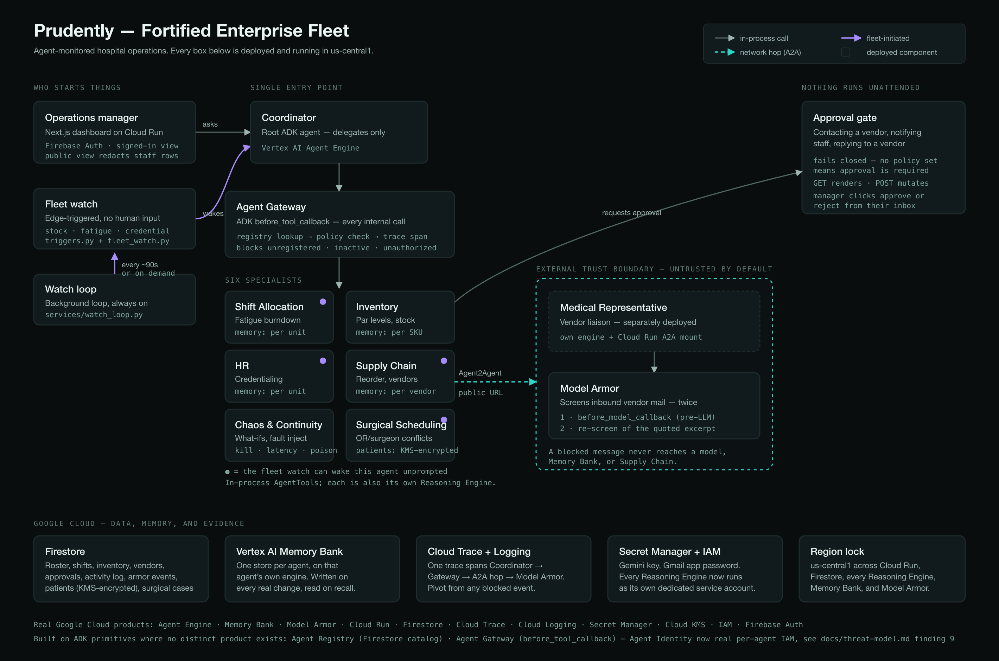

# Prudently

**The fleet that never waits to be asked.**

## Inspiration

A hospital's day-to-day survival runs on three things nobody can watch every minute of every
shift: who's on the floor and how tired they are, what's actually left in the supply room, and
which vendors can deliver before it's too late. Those are exactly the slow-burning signals a
single generalist chatbot is bad at and a fleet of specialists is good at — not one assistant
answering questions when someone remembers to ask, but a Coordinator routing through a real
Gateway to agents that each own one slice of the problem, plus one agent that has to live on the
wrong side of a trust boundary because its job is talking to the outside world. The Fortified
Enterprise Fleet track's seven platform capabilities — Registry, Identity, Gateway, Model Armor,
Observability, Agent Engine, Memory Bank — read like the actual production checklist a hospital
IT team would demand before letting agents anywhere near real operations. We built for that
checklist, not around it. And the clearest way to prove "agent-*monitored*," not just
"agent-*assisted*," was to make the fleet act before anyone asks it to.

## What it does

Eight agents run a hospital's staffing, supplies, vendor relationships, and surgical schedule,
live. A **Coordinator** is the only user-facing entry point and never answers from its own
knowledge — every internal call it makes passes through an **Agent Gateway** that looks the
target up in a Firestore registry, checks a policy table, and opens a real trace span, all
before the tool body runs. Behind it: **Shift Allocation** (fatigue and overtime burndown),
**Inventory Management** (par-level tracking), **Supply Chain Resiliency** (reorder decisions
and vendor selection, plus a real generated purchase-order document), **HR** (credentialing, and
Shift's escalation target when coverage runs out), **Chaos & Continuity** (what-if projections
and fault injection against the fleet itself), and **Surgical Scheduling** — the newest agent,
and the one domain with real-PII-shaped data. It detects OR and surgeon double-bookings, resolves
them, and notifies the affected patient only with their consent and only after manager approval;
every patient's name, date of birth, and contact details are encrypted field-by-field with
**Cloud KMS** before they ever reach Firestore. A seventh agent, **Medical Representative**, is
deployed and identified separately and reached only over genuine **Agent2Agent** — the one real
external trust boundary in the design — where **Model Armor** screens every inbound vendor
message *twice*: once before a model ever sees it, and again on the excerpt the model itself
extracts, because a paraphrased injection slipped past the first layer in testing and the second
one caught it.

The fleet doesn't wait to be asked. A real-time watch runs continuously against live Firestore
state — no scripted timeline, no button to press — and wakes the responsible agent the instant
something actually crosses a line: a SKU falling past its reorder point, a unit gaining another
critically fatigued nurse, a staff credential expiring, two surgeries double-booked into the same
OR. Anything with a real-world consequence still comes back to a human first — contacting a
vendor, notifying staff, notifying a patient, replying to a vendor all land as a real HTML email
with an approve/reject link that expires after 14 days, governed by a manager-editable policy
that fails closed. Every agent remembers across time in its own Vertex AI Memory Bank store, so
asking Shift whether ICU fatigue has been building gets an answer that cites *when* it started,
not just today's snapshot. And one Cloud Trace span follows every request end to end —
Coordinator, the Gateway's decision, the A2A hop, Model Armor's verdict — so a blocked event in
the dashboard pivots straight to the real waterfall behind it.

None of this is theoretical about who's allowed to see what. Firebase custom claims gate
`admin`/`clinician`/`ops` roles; a patient's decrypted identity is the one thing an `ops`-role
viewer never sees. Every deployed Reasoning Engine — all eight — runs under its own dedicated
service account, not a shared platform identity; Cloud KMS decrypt access is scoped to exactly
two of them. Ten STRIDE threat-model findings, each cited to real file:line evidence, are each
fixed or honestly mitigated — the full write-up is in the repo (`docs/threat-model.md`), because
a security posture nobody can audit isn't one.

## How we built it

Google ADK for every agent, each deployed individually to Vertex AI Agent Engine as its own
Reasoning Engine, behind a FastAPI backend and a Next.js dashboard, both on Cloud Run. Firestore
holds live state and every agent's audit trail. The Coordinator wraps its six gated specialists
as in-process `AgentTool`s via a flattened-import trick that only resolves correctly under two
different conditions locally vs. deployed — verified with a disposable probe deploy before
betting the real build on it. Medical Representative is reached via
`google.adk.a2a.utils.agent_to_a2a.to_a2a()`, mounted on the same Cloud Run service that serves
the dashboard API, since its own separately-deployed Reasoning Engine already satisfies
"separately deployed, separately identified." Registry and Gateway are built honestly on
Firestore and ADK primitives, not dressed up as distinct Google Cloud products — we went looking
for a real one behind each and documented exactly what we checked when we didn't find one,
rather than claim more than what's there.

Agent Identity started in that same category — "no such product, built on a convention instead"
— and stayed there for most of the build, on a real finding: `adk deploy agent_engine`'s CLI has
no `--service_account` flag, so every deployed Reasoning Engine ran as the same Google-managed
identity. What actually closed it was refusing to let that CLI limitation stand in for a platform
limitation without checking: the SDK the CLI itself calls (`vertexai._genai.types.common
.AgentEngineConfig`) has a real `service_account` field, reachable through a
`.agent_engine_config.json` file the CLI already reads per agent folder. All eight engines now
run as their own dedicated service account — confirmed live via each one's own
`effective_identity`, not assumed from a Terraform plan — and Cloud KMS's patient-PII key is
scoped to exactly two of them instead of the one shared identity every agent used to share.

Patient PII is protected with direct Cloud KMS field-level encryption — not envelope encryption
with a locally-managed key, since every value protected (a name, a DOB, an email, a phone number)
is a few dozen bytes, well inside a symmetric key's payload limit, so a local DEK would add
complexity without adding protection. RBAC rides on Firebase custom claims
(`role: admin | clinician | ops`), checked server-side on every patient-identity route.

The autonomous fleet watch runs its agent turns *in-process*, not through the Reasoning Engine
network transport — a deliberate call after `stream_query` against a deployed engine reset
mid-stream on three of four attempts from this environment. The backend already runs the same
agent objects the Reasoning Engines serve, so calling them directly is a genuine agent turn —
real model call, real tools, real Gateway and approval path — just not one that exercises the
Agent Engine transport, which the manager-initiated path already covers. It didn't start this
way: for most of the build, the fleet only acted when a human pressed a **Next day** button on a
scripted 21-day sim clock. The day before submission, we tore that out completely — deleted the
clock, put the trigger logic (which was always a pure state comparison and never actually needed
a day number) behind a background loop that checks live state on its own every 90 seconds, and
gave the dashboard a dark, mission-control visual language to match, because a fleet that only
proves itself when someone clicks something isn't the thing being judged.

## Challenges we ran into

Nearly every hard bug here had the same shape: something that looked like success — `exit 0`, a
green smoke test, no error in the console — while the real thing had quietly failed. `adk
deploy` exits clean and can still serve a stale warm sandbox for a few calls before a cold start
reveals the real `ModuleNotFoundError`. A misconfigured Memory Bank region silently killed the
entire autonomous-watch pipeline with no error anywhere an operator would look, until a
deliberately loud rewrite fixed that. A new endpoint's 500 rendered in the browser as a CORS
error, because Starlette only attaches CORS headers to responses that finish normally — the
real cause, a missing IAM role on the Cloud Run service's own identity, was only visible in
Cloud Run's own logs. A `shift_history` doc-ID collision silently collapsed 21 days of fatigue
history into one document per person, meaning the flagship fatigue-risk feature had likely never
been able to flag anyone as genuinely at risk, in production, until we noticed the document
count didn't match what 28 days of seeded history should produce.

And then, hours before submission: we replaced the scripted depletion curve with a small
ongoing "ambient consumption" tick meant to keep inventory quietly moving in the background. The
math was wrong — it applied a *full day's* depletion on every 90-second watch cycle instead of a
sliver of one. Every SKU crashed to critical stock within about five minutes of deploying, and
**26 real approval-request emails landed in an actual inbox** before we caught it by checking the
live Firestore data rather than trusting the deploy log. We fixed the scaling, redeployed,
cleared the flood, and forced one clean cycle to prove it: **exactly 11 triggers fired** — four
units' fatigue, five expired credentials, two genuinely tight SKUs — matching live reality
precisely, with zero runaway afterward. It's a fitting last bug for this project: the fastest way
to prove the watch's edge-triggering logic was sound turned out to be watching it get raced by a
real timing mistake, and then verifying the very next clean run got the count exactly right.

The very last bug — after the Agent Identity fix above, and worse for being self-inflicted: a
session-revocation improvement (`verify_id_token(..., check_revoked=True)`, so a manually
revoked session actually stops working instead of riding out its natural expiry) makes one extra
call to Firebase's Identity Toolkit API on every request. Nobody had granted the Cloud Run
service's own identity permission to make that call. Every authenticated route on the deployed
site 401'd for a genuinely signed-in user — for hours, invisibly, because the exception handler
caught the real cause and returned a generic "Invalid or expired session" without ever logging
it, exactly the failure shape every bug in this section already shares. Found from a plain user
report ("I'm signed in and it still says sign in"), root-caused from Cloud Run's own request
logs (every request truly was 401ing, confirming it wasn't a frontend bug), fixed with one scoped
IAM grant and an actual `logger.warning` on the exception that should have said so from the
start.

## Accomplishments that we're proud of

Getting a genuine Agent2Agent hop working end to end, not a function call wearing an A2A
costume — confirmed with a discriminating trace test that followed a real httpx client span
from Supply Chain's own process, through Cloud Run's ASGI root span, into Medical
Representative's pre-LLM screening, all correctly nested in one Cloud Trace waterfall. Building
a defense-in-depth Model Armor boundary and watching the second layer actually earn its keep in
testing, not just on paper — the first layer let a paraphrased injection through, and the
re-screen of the isolated excerpt caught it. Turning a fleet that only proved itself on command
into one that proves itself on its own: checking the real seed generators directly rather than
assuming, finding that fatigue and credential-expiry conditions are already critical at plain
seed time, and wiring the watch so that's exactly when the fleet acts — verified live, down to
the exact trigger count, against real production data. And, arguably the one we're proudest of:
not accepting our own earlier documentation that Agent Identity "can't be enforced on this
platform" at face value. That line was true of a CLI flag, not of the platform — reading the SDK
underneath the CLI instead of the CLI's own `--help` output is what actually closed a mandatory
Fortified Enterprise Fleet capability we'd otherwise have shipped honestly-disclosed-but-unfixed.

## What we learned

That "the deploy succeeded" and "the deployed thing works" are different claims, and the gap
between them is where almost every real bug in this project lived — which is why nearly every
milestone here ends with a live check against the actual deployed engine or the actual browser
console, not trust in an exit code. That pure-logic modules — burndown math, par-level status,
credentialing, trigger detection — pulled out from ADK orchestration glue are worth the
discipline even under deadline pressure: they're what let a same-day rewrite of the entire
autonomy mechanism ship with 97% coverage and zero regressions instead of a guess. And that a
system built to survive being replayed — deterministic seeding, an explicit reset path,
edge-triggered rather than level-triggered logic — is, not coincidentally, the same discipline
that makes a system trustworthy enough to run unattended in the first place.

## What's next for Prudently

A fifth trigger axis for vendor reliability degradation, so Supply Chain can act on a pattern
across purchase orders instead of only a single stock breach. Real contact information once this
moves past synthetic data, instead of every approval-gated send routing to the operations
mailbox with a cosmetic recipient label. A distributed lock around the watch loop before this
ever runs on more than one Cloud Run instance at once — two independent loops on two instances
would double-fire every check today, exactly the kind of failure mode this project has learned
to go looking for instead of hoping isn't there. And the one honest gap the threat model states
plainly rather than glosses over: Firestore has no native per-collection IAM, so even with every
agent now running under its own dedicated identity, access to `patients`/`surgical_cases` is
still enforced at the application layer (`services/platform/access_control.py`), not by IAM
alone — a real, useful, but not cryptographic boundary. Closing that fully would mean either a
Firestore-adjacent authorization layer this platform doesn't have yet, or moving patient data to
a datastore that supports resource-level IAM natively — a bigger architectural call than a
hackathon week has room for, and one we'd rather flag honestly than paper over.
