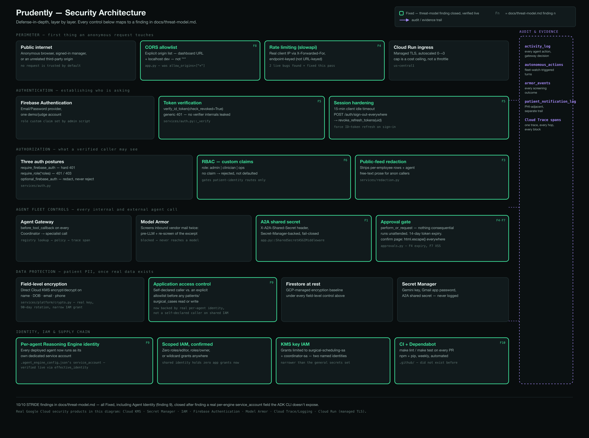
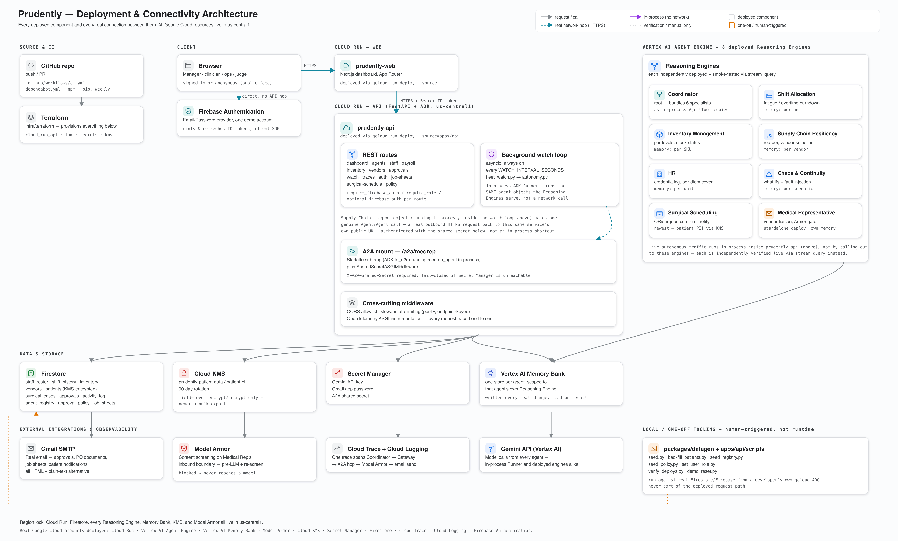

# Prudently

**The fleet that never waits to be asked.**

## Inspiration

- A hospital runs on things nobody can watch every minute: who's on shift and how tired, what's
  left in the supply room, which vendors can deliver, whether two surgeries just got
  double-booked.
- Those are slow-burning signals a chatbot handles badly and a fleet of specialists handles well.
- The Fortified Enterprise Fleet track lists seven capabilities — Registry, Identity, Gateway,
  Model Armor, Observability, Agent Engine, Memory Bank. That list matches a hospital IT
  checklist more than a demo checklist, so we built to it directly instead of bolting it on
  after.
- Proving "agent-*monitored*" instead of "agent-*assisted*" meant the fleet had to act before
  anyone opened the dashboard.

## What it does

Eight agents on live Firestore state, deployed as eight separate Vertex AI Reasoning Engines.

**The fleet**
- **Coordinator** — root agent, delegates only. Every call it makes goes through the **Agent
  Gateway**, an ADK `before_tool_callback` that does a Firestore registry lookup and a policy
  check before the tool body runs.
- **Shift Allocation** — burndown ratio (trailing hours vs. a per-role safe-hours cap) drives
  fatigue risk and reallocation.
- **Inventory Management** — par-level math against `baseline_daily_consumption` and
  `reorder_point`.
- **Supply Chain Resiliency** — picks a vendor on lead time and reliability score, flags
  `routine` vs. `expedited`, generates a purchase-order document.
- **HR** — credential expiry tracking, activates the per-diem pool when Shift runs out of
  reallocation options.
- **Chaos & Continuity** — three fault-injection modes (kill an agent, poison Memory Bank,
  inject latency) plus hospital what-if projections.
- **Surgical Scheduling** — pure interval-overlap check on `operating_room`/`surgeon_staff_id`
  for double-bookings; patient name, DOB, and contact are AES-backed Cloud KMS ciphertext at
  rest, decrypted only for `admin`/`clinician` roles.
- **Medical Representative** — a `RemoteA2aAgent` reaching a separately deployed engine over
  Agent2Agent, the one external trust boundary in the design. Model Armor runs
  `sanitizeUserPrompt` before the message reaches a model and `sanitizeModelResponse` on the
  excerpt the model extracts — the second pass caught a paraphrased injection the first one let
  through.

**Autonomy**
- `services/triggers.py` diffs current state against the last snapshot and fires only on a
  transition — a SKU crossing `reorder_point`, a unit's critical-fatigue count going up.
- Anything with a side effect routes through `perform_or_request`: an HTML email, approve/reject
  links, a 14-day token expiry, fail-closed if nobody's configured a policy for that task type.
- Vertex AI Memory Bank, scoped `(app_name, user_id)` per agent — Shift by unit, Inventory by
  SKU.
- One OpenTelemetry trace, exported to Cloud Trace, spans Coordinator → Gateway → the A2A hop →
  Model Armor's verdict.

**Security**
- Firebase custom claims (`role: admin | clinician | ops`) checked server-side on every
  patient-identity route; no claim gets rejected, not defaulted.
- Every one of the 8 Reasoning Engines runs under its own dedicated IAM service account.
- `roles/cloudkms.cryptoKeyEncrypterDecrypter` on the patient-PII key is granted to exactly two
  of those service accounts.

## How we built it

**Stack**
- Google ADK 2.7.1, each agent its own Vertex AI Reasoning Engine
- FastAPI backend, Next.js/React dashboard, both on Cloud Run; Firestore (Native mode) for live
  state and every audit collection
- Coordinator wraps six specialists as in-process `AgentTool`s, staged via `adk deploy`'s
  `--extra_packages` flattened-import mechanism
- Medical Representative mounted through ADK's `to_a2a()` on the same Cloud Run service as the
  dashboard API
- Registry and Gateway run on Firestore + an ADK interceptor — we checked for a distinct GCP
  product behind each and wrote down what we found instead of assuming one existed

**The Agent Identity fix**
- `adk deploy agent_engine` has no `--service_account` flag, so by default every Reasoning
  Engine authenticates as one Google-managed service agent
- `vertexai._genai.types.common.AgentEngineConfig` — the object that CLI actually builds — has a
  `service_account` field, reachable via a `.agent_engine_config.json` file the CLI already
  reads per agent folder
- All 8 engines now carry their own service account, confirmed against
  `client.agent_engines.get(...).api_resource.spec.effective_identity` for each

**Everything else**
- Cloud KMS field-level encrypt/decrypt on patient PII, not envelope encryption — each protected
  value is a few dozen bytes, well under a symmetric key's payload limit
- Autonomous turns run through an in-process `google.adk.runners.Runner`, not
  `stream_query` against the deployed engine — `stream_query` reset mid-stream on 3 of 4 calls
  from this environment during testing
- For most of the build, triggers only fired off a scripted 21-day sim clock. The day before
  submission that got replaced with an asyncio loop polling live state every 90 seconds

## By the numbers

- 8 agents, 1 Agent2Agent hop, 0 simulated ones
- 187 backend tests, 97% line coverage, pylint 10.00/10
- 26 approval emails sent by a consumption-scaling bug, 11 triggers on the corrected run
- 2 IAM grants missing after the identity migration (`roles/modelarmor.user`,
  `roles/cloudtrace.agent`), caught before the old shared identity's grants were removed
- 1 session-revocation IAM gap that 401'd every authenticated route until a user reported it

## Challenges we ran into

- `adk deploy` exits 0 and can still serve a stale sandbox for a few calls before a cold start
  surfaces the real `ModuleNotFoundError`.
- A misconfigured Memory Bank region (`us` instead of `us-central1`) killed the whole autonomy
  pipeline with no exception anywhere an operator would look.
- A `shift_history` document-ID collision collapsed 21 days of fatigue history into one document
  per staff member — the fatigue-risk feature had likely never flagged anyone correctly until
  the record count stopped matching the seed.
- A consumption-scaling bug applied a full day's inventory depletion on every 90-second cycle
  instead of a fraction of one. Every SKU hit critical stock in about five minutes, and 26 real
  approval emails went out before Firestore data — not the deploy log — caught it.
- The `check_revoked=True` session-revocation change added a call to Identity Toolkit that
  `coordinator-agent-sa` had no IAM grant for. Every authenticated route 401'd for signed-in
  users, and the exception handler discarded the underlying error before it ever reached Cloud
  Logging. A support ticket surfaced it; Cloud Run's own request logs confirmed it wasn't a
  frontend bug; one `roles/firebaseauth.viewer` grant closed it.

## Accomplishments we're proud of

- An Agent2Agent call that shows up as a distinct httpx span inside one Cloud Trace waterfall,
  not a same-process function call relabeled as A2A.
- A Model Armor second pass that caught something the pre-model pass missed, in testing, not
  hypothetically.
- Trigger detection that fires correctly off unmodified seed data, verified against the exact
  count a clean watch cycle produced.
- Reopening our own note that said Agent Identity "can't be enforced on this platform" and
  finding out it described a CLI flag, not the platform.

## What we learned

- A deploy exiting 0 and a deployed engine actually working are two different claims, and most
  of the real bugs here lived in the gap between them.
- Pulling burndown math, par-level checks, and trigger logic out of the ADK orchestration layer
  into plain functions made a same-day rewrite of the autonomy path land at 97% coverage with no
  regressions.
- Deterministic seeding and edge-triggered logic — built for replaying demos cleanly — turned out
  to be the same property that makes unattended operation safe.

## What's next

- A fifth trigger axis for vendor reliability degradation across purchase-order history
- Real contact fields once this runs on anything other than synthetic data
- A distributed lock on the watch loop before it runs on more than one Cloud Run instance
- Firestore has no per-collection IAM — patient-data access is enforced by
  `services/platform/access_control.py`'s allowlist at the application layer, not by IAM alone.
  Closing that gap means either a Firestore-adjacent authorization layer or a datastore with
  native resource-level IAM, neither of which fit in a hackathon week.
